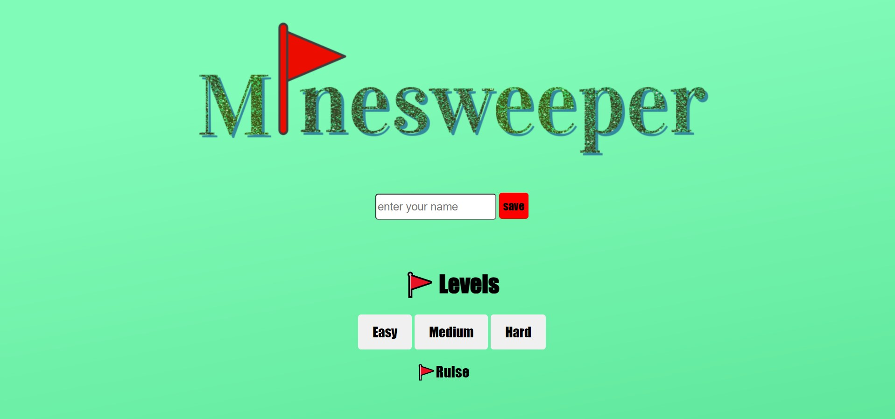

# Minesweeper Game

A classic Minesweeper game built with JavaScript, HTML, and CSS. This project offers an enjoyable experience, similar to the traditional Minesweeper game.

## Features

- **Three Difficulty Levels:** Each level has a fixed number of mines and a specific board size.
- **Flagging Mines:** Players can mark suspected mine locations with flags by right-clicking on the tiles.
- **Sound Effects:** includes background music and sound effects that match each action.


## Installation

To run the game locally, follow these steps:

1. Clone the repository:
   ```bash
   git clone https://github.com/yourusername/minesweeper-game.git
    ```
2.  Navigate to the project directory:
    ```bash
    cd Cake-Ninga
    ```
## Usage

Open the `game.html` file in your web browser to start playing.

## screenshots:




